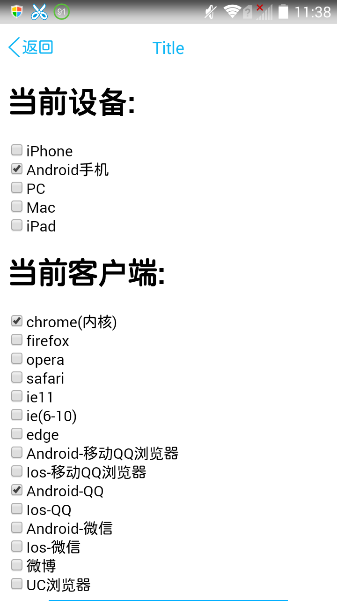
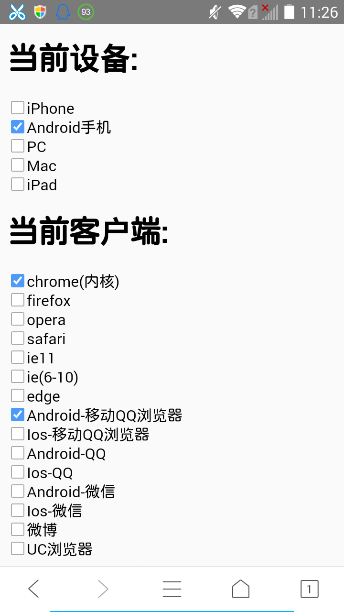
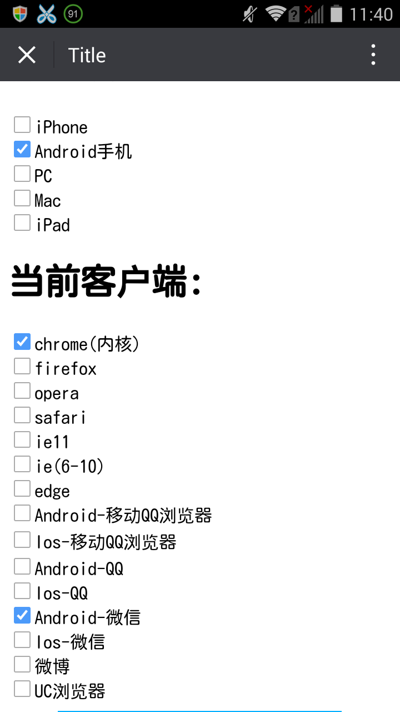
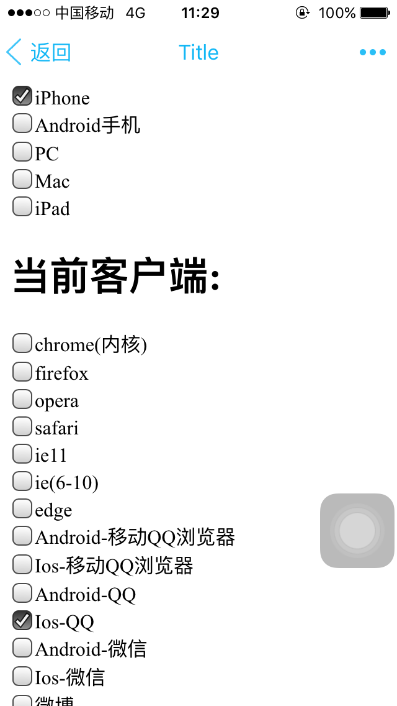
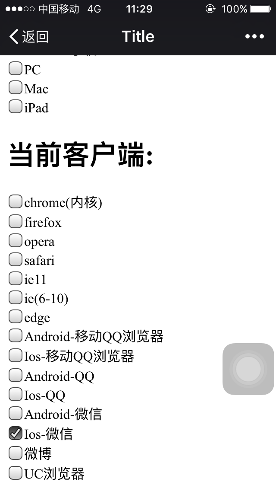

# 介绍

&emsp;&emsp;最近有个需求:判断浏览的入口，最常用的是判断微信端和QQ端还有微博端的内置浏览器。后来觉得反正都写了手机端的，要不就来个总和吧，把各大浏览器都判断一次，方便日后使用。  

| Desktop   | Mobile        |	OS	|
| ----------|:-------------:|:----------:|
| Chrome    | QQ 			|  Ios			|          
| Firefox   | QQ-Browser    |	Android		|
| Safari	|  UC-Browser      |	Mac OS		|
| Ie11      | WeiBo 		|	Windows	|
| Ie(6-10)  |   WeChat	|		|
| Opera	 	|				 |			|
| Edge      |	 			|

__据我测试到以上表格都可以判断，但不代表会出差错，如果有请指出。__

&emsp;&emsp;基本原理是根据浏览的一个属性,然后就用indexOf和正则去匹配，有外国的大神用浏览器的私有属性来判断 [查看](https://stackoverflow.com/questions/9847580/how-to-detect-safari-chrome-ie-firefox-and-opera-browser) :joy::joy:但作为前端新人还有很多弄不懂的东西，不敢轻易搬运大神的代码，所以还是自己老老实实的写正则。

```JavaScript
navigator.userAgent;  
```
&emsp;&emsp;主要是从浏览器返回的信息来判断,详细的请移步我的测试 [部分浏览器测试](./Browser-test.txt)。  
# 思路

&emsp;&emsp;首先，我用我要把各种要判断的浏览器的 __navigator.userAgent__ 拿到，再分析返回的字符串，写一个class把属性给存起来。
这里用到的主要是[indexOf](https://developer.mozilla.org/zh-CN/docs/Web/JavaScript/Reference/Global_Objects/String/indexOf)和[match](https://developer.mozilla.org/zh-CN/docs/Web/JavaScript/Reference/Global_Objects/Symbol/match)这两个知识点。然后再处理一下逻辑，就可以判断了，难点就在于处理这些逻辑，需要注意的是Safari和Chrome ,IE11和IE(6-10)。前者是大致相同(同基于Webkit)，后者是天差地别(夸张了)。

```JavaScript
class checkBrowser {
    constructor() {
        this.userAgent = navigator.userAgent;
        this.Android = this.userAgent.indexOf('Android') > -1 || this.userAgent.indexOf('Linux') > -1;
        this.IPhone = this.userAgent.indexOf("iPhone") != -1;
        this.Ios = this.userAgent.indexOf('iPhone') > -1 || this.userAgent.indexOf('Mac') > -1;
        this.Ipad = this.userAgent.indexOf('iPad') > -1;
        this.Opera = this.userAgent.indexOf("Opera") > -1;
        this.IE = this.userAgent.indexOf("compatible") > -1 && this.userAgent.indexOf('MSIE') > -1 && !this.Opera;
        this.Edge = this.userAgent.indexOf("Edge") > -1;
        this.FireFox = this.userAgent.indexOf('Firefox') > -1;
        this.Safari = this.userAgent.indexOf('Safari') > -1 && this.userAgent.indexOf('Chrome') == -1;
        this.Chrome = !this.Edge && this.userAgent.indexOf('Chrome') > -1 && this.userAgent.indexOf('Safari') > -1;
        this.IE11 = this.userAgent.indexOf('Trident') > -1 && this.userAgent.indexOf('rv:11.0') > -1;
        this.Wechat=!!this.userAgent.match(/MicroMessenger/i);
        this.Weibo=!!this.userAgent.match(/Weibo/i);
        this.UCBrowser=!!this.userAgent.match(/UCBrowser/i);
        this.QQ=!!this.userAgent.match(/QQ/i);
        this.QQBrowser=!this.userAgent.indexOf('MQQBrowser') > -1 && this.userAgent.indexOf('QQ/');
    }
}
````
## 判断各个IE版本方法 

&emsp;&emsp;判断各个版本的IE浏览器  
```JavaScript
    isIe(){
        if(this.IE){
            var reIE=new RegExp('MSIE (\\d+\\.\\d+);');
            reIE.test(this.userAgent);
            var IE_version=parseFloat(["$1"]);

            var reIE = new RegExp("MSIE (\\d+\\.\\d+);");
            reIE.test(this.userAgent);
            var fIEVersion = parseFloat(RegExp["$1"]);
            if (fIEVersion == 7) {
                document.writeln("IE版本:"+7+'<br>');
            } else if (fIEVersion == 8) {
                document.writeln("IE版本:"+8+'<br>');
            } else if (fIEVersion == 9) {
                document.writeln("IE版本:"+9+'<br>');
            } else if (fIEVersion == 10) {
                document.writeln("IE版本:"+10+'<br>');
            } else {
                document.writeln("IE版本:"+6+'<br>');
            }
        }
    }
```

## 判断浏览器  
```JavaScript
    isEntry() { // 浏览器入口
        if (this.Chrome) {
            fun(oEntry, 'Chrome');
        }
        if(this.FireFox){
            fun(oEntry, 'FireFox');
        }
        if(this.Safari){
            fun(oEntry, 'Safari');
        }
        if(this.IE11){
            fun(oEntry, 'Ie11');
        }
        if(this.IE){
            fun(oEntry,'Ie')
        }
        if(this.Edge){
            fun(oEntry, 'Edge');
        }

        if(this.Wechat || this.Android && this.QQBrowser=='-1' && this.QQ){ // 判断安卓 QQ内置 或者 QQ浏览器  微信X5内核
            if(this.Wechat && this.Android){
                fun(oEntry,'AndroidWeChat');
            }else if(this.WinWeChat ){
                alert('电脑微信端');
            }else {
                fun(oEntry,'AndroidQQBrowser');
            }
        }else if(this.Android && this.QQ){
            fun(oEntry,'AndroidQQ');
        }

        if(this.IPhone && this.Wechat){
            fun(oEntry,'IosWeChat');
        }

        if(this.Weibo){
            fun(oEntry,'WeiBo')
        }

        if(this.UCBrowser){
            fun(oEntry,'UCBrowser');
        }

        if(this.IPhone && this.QQBrowser=='-1' && this.QQ ){ // iPhone QQ内置 或 QQ浏览器
            fun(oEntry,'IosQQBrowser');
        }else if(this.IPhone && this.QQ){
            fun(oEntry,'IosQQ');
        }
    }
```
## 判断操作系统(实验性)
```JavaScript
    isOS() {
        if (!!this.userAgent.match(/compatible/i) || this.userAgent.match(/Windows/i)) {
            fun(osInput, 'windows');
        } else if (!!this.userAgent.match(/Macintosh/i) || this.userAgent.match(/MacIntel/i)) { 
            fun(osInput, 'macOS');
        } else if (!!this.userAgent.match(/iphone/i) || this.userAgent.match(/Ipad/i)) {
            fun(osInput, 'ios');
        } else if (!!this.userAgent.match(/android/i)) {
            fun(osInput, 'android');
        } else {
            fun(osInput, 'other');
        }
    }
```
## 判断电脑端和移动端
```JavaScript
    isMobile(){ //detection PC and Mobile
        if(!!this.userAgent.match(/AppleWebKit.*Mobile.*/) && !!this.userAgent.match(/AppleWebKit/)){
            document.writeln('Browser:'+'Mobile Browser'+'<hr>');
        }else {
            document.writeln('Browser:'+'Desktop Browser'+'<hr>');
        }
    }
```
## 测试截图
#### 安卓QQ

#### 安卓QQ浏览器

#### 安卓微信

#### iPhoneQQ

#### iPhone微信



